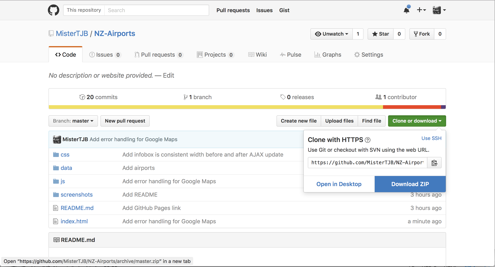
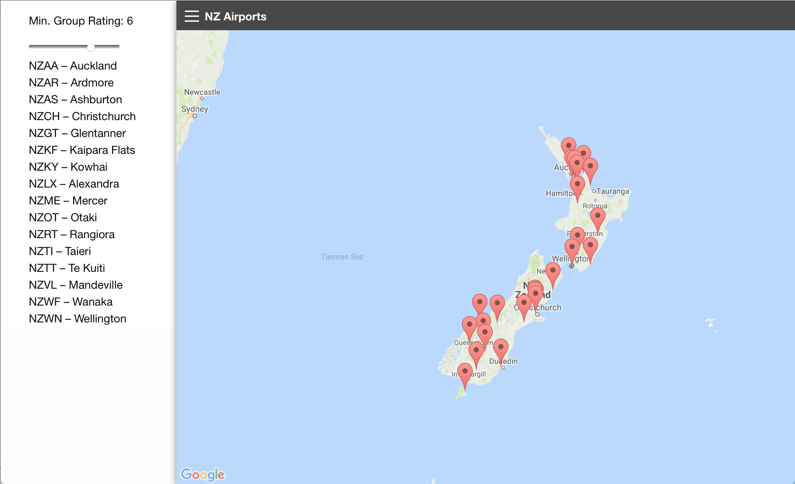
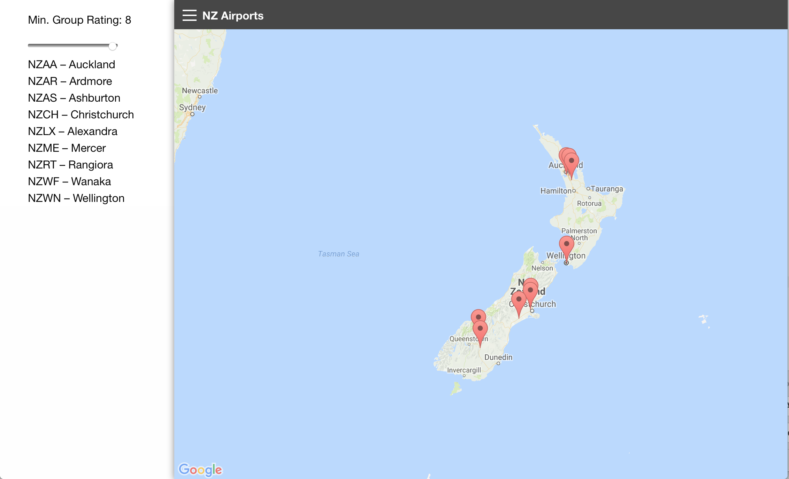
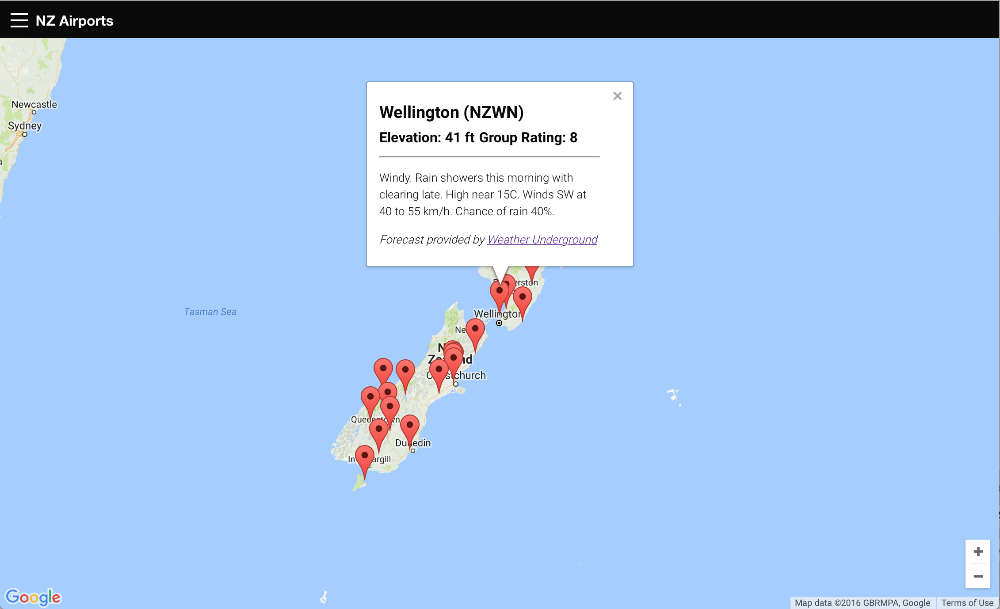

# NZ Airports

## Overview
NZ Airports is a web application that allows users to filter local airports by _group rating_ – a specification for runways and aeroplanes that indicates whether a particular model of plane can safely operate on a given runway – and then 'browse' suitable airports to discover airports having favourable weather conditions.

## Starting the App

### Local
The app can be downloaded and run locally. The simplest way to do this is to download the project as a zip file from GitHub.

_Downloading from GitHub_

Once the project is downloaded, navigate to the project folder and open `index.html`; this should launch the application in your web browser.

### GitHub Pages

The application is hosted on GitHub Pages. Just follow [this link](https://mistertjb.github.io/NZ-Airports/) to the application.

## Using the App

The typical pattern for using the application is as follows:

1. Open the off-canvas menu to the left of the screen
2. Use the slider to filter by minimum group rating (e.g. an aeroplane having a group rating of 5 is capable of operating from runways with a group rating of 5 or more)
3. Select an airport from the list, or close the off-canvas menu and select an airport from the map
4. Selecting an airport renders an infobox containing basic information about the airport and weather information

_Initial state_

_Filtered by the most restrictive group rating_

_The infobox shows basic airport and forecast information_
## Attribution

Forecast information is sourced from wunderground.com